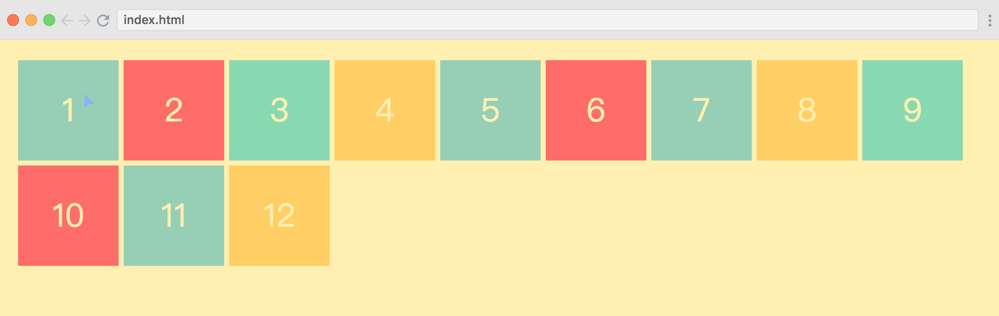

[CSS-Grid浏览器支持状态](https://caniuse.com/#feat=css-grid)

这篇文章内容来自 [scrimba的教程](https://scrimba.com/g/gR8PTE)，是一个视频+实时修改代码的教程网站，有能力听懂英语的可以去看一下，体验效果非常棒。这里主要记录一下CSS Grid的基础使用方式。

代码已经上传到GitHub： 

CSS网格布局，是基于网格的二维布局系统，目标是使用尽量少的代码来基于网格布局设计网页，目前的css对于布局还是有很多的问题，最开始，我们是用table、float、positioning和inline-block，但是它们存在一大堆hack的问题，并且缺少一些必不可少的特性，比如垂直居中。后来，我们使用flex布局，它非常有用，但是它是一维布局，在二维方面它就无能为力了。Grid的出现解决了长期以来我们需要通过hack的方式实现的很多功能。

深入了解：

Chris Coyier's [A Complete Guide to Flexbox](https://css-tricks.com/snippets/css/a-guide-to-flexbox/), 

 [A Complete Guide to Grid](https://css-tricks.com/snippets/css/complete-guide-grid/)

Rachel Andrew's awesome book [Get Ready for CSS Grid Layout.](http://abookapart.com/products/get-ready-for-css-grid-layout) 


### 1 FirstCssGrid

#### 1.1 模板

首先，我们需要一个HTML文件，里面有6个div。

```html
<html>
    <head>
        <link rel="stylesheet" href="basic.css">
    </head>
    <body>
        <div class="container">
            <div>1</div>
            <div>2</div>
            <div>3</div>
            <div>4</div>
            <div>5</div>
            <div>6</div>
        </div>
    </body>
</html>
```

然后，一个基础的美化样式的通用css。

```css
.container > div {
  display: flex;
  justify-content: center;
  align-items: center;
  font-size: 2em;
  color: #ffeead;
}

html, body {
background-color: #ffeead;
margin: 10px;
}

.container > div:nth-child(1n) {
background-color: #96ceb4;	
}

.container > div:nth-child(3n) {
background-color: #88d8b0;
}

.container > div:nth-child(2n) {
    background-color: #ff6f69;
}

.container > div:nth-child(4n) {
    background-color: #ffcc5c;
}


```

现在我们来对container进行修改，使用grid布局。

```css
.container {
    display: grid;
  	// 定义列方向上的布局，3列，左右固定宽度，中间自适应
    grid-template-columns: 100px auto 100px;
  	// 定义行方向上的布局，2行，每行50px，超出的行高为默认
    grid-template-rows: 50px 50px;
  	// 每个元素之间的间距
    grid-gap: 3px;
}
```

结果如下图：非常优秀的3列布局，只要4行代码。


我们可以定义更多行。

```css
.container {
  display: grid;
  grid-template-columns: 100px auto;
  grid-template-rows: 50px 50px 200px;
  grid-gap: 3px;
}
```


#### 1.2 Fraction

使用fr单位进行自适应布局，fr是fraction的缩写，根据个数每个平分整个屏幕。

```css
.container {
    display: grid;
    grid-template-columns: 1fr 2fr 1fr;
    grid-template-rows: 50px 50px;
    grid-gap: 3px;
}
```


#### 1.3 repeat

repeat第一个参数是元素个数，第二个参数是元素宽度。

```css
.container {
    display: grid;
    grid-template-columns: repeat(6, 1fr);
    grid-template-rows: 50px 50px;
    grid-gap: 3px;
}
```


### 2 BasicLayout

#### 2.1 简单的网页布局

这里我们把元素换成了，Header、menu、content、footer这种常见的布局。

```html
<html>
    <head>
        <link rel="stylesheet" href="index.css">
        <link rel="stylesheet" href="basic.css">
    </head>
    <body>
        <div class="container">
            <div class="header">HEADER</div>
            <div class="menu">MENU</div>
            <div class="content">CONTENT</div>
            <div class="footer">FOOTER</div>
        </div>
    </body>
</html>
```

basic.css使用之前的文件，这里不再列出。

```css
// index.css
.container {
  display: grid;
  grid-gap: 3px;
  grid-template-columns: repeat(12, 1fr);
  grid-template-rows: 40px 200px 40px;
}
// 从第一列到最后一列，占满整行
.header {
  grid-column: 1 / -1;
}
// 从第二个位置到最后一个位置。
.content {
  grid-column: 2 / -1;
}
// 和header一样，占满整行
.footer {
  grid-column: 1 / -1;
}
// menu根据顺序默认放在了第二行的第一个位置
```


#### 2.2 另一种布局

```css
.container {
    display: grid;
    grid-gap: 3px;
    grid-template-columns: repeat(12, 1fr);
    grid-template-rows: 40px 200px 40px;
}
// 从第二个位置到最后一个位置
.header {
    grid-column: 2 / -1;
}
// 按行算，第一个位置开始，第三个位置结束，实际上占了两个位置
.menu {
    grid-row: 1 / 3;
}

.content {
    grid-column: 2 / -1;
}

.footer {
    grid-column: 1 / -1;
}
```


#### 2.3 描绘式

```css
.container {
  height: 100%;
  display: grid;
  grid-gap: 3px;
  // 定义一行12fr
  grid-template-columns: repeat(12, 1fr);
  // 3行，中间自适应
  grid-template-rows: 40px auto 40px;
  // 用字符描绘了整个布局
  grid-template-areas: 
      "m h h h h h h h h h h h"
      "m c c c c c c c c c c c"
      "m f f f f f f f f f f f";
}
// 占据h定义的位置
.header {
  grid-area: h;
}
// 占据m定义的位置
.menu {
  grid-area: m;
}
// 占据c定义的位置
.content {
  grid-area: c;
}
// 占据f定义的位置
.footer {
  grid-area: f;
}
```

整个布局就像画出来的一样，awesome！


### 3 AwesomeAutoFit

关于响应式布局，我们已经接触过很多了，通过媒体查询动态修改样式，有了css grid，我们就可以不需要媒体查询来完成响应式的布局。

现在我们有12个简单的div。

```html
<html>
    <head>
        <link rel="stylesheet" href="index.css">
        <link rel="stylesheet" href="basic.css">
    </head>
    <body>
        <div class="container">
            <div>1</div>
            <div>2</div>
            <div>3</div>
            <div>4</div>
            <div>5</div>
            <div>6</div>
            <div>7</div>
            <div>8</div>
            <div>9</div>
            <div>10</div>
            <div>11</div>
            <div>12</div>
        </div>
    </body>
</html>
```

```css
// index.css
.container {
  display: grid;
  grid-gap: 5px;
  // 自适应每行的个数，每个元素100px，尽量放下最多元素
  grid-template-columns: repeat(auto-fit, 100px);
  grid-template-rows: repeat(2, 100px);
}
```

现在，我们看到，根据屏幕的宽度，每行的个数是自适应的。




#### 3.1 minmax

但是，这样在缩放的时候，存在一定的问题，当行宽不是100整倍数时，比如689px，就会显示如下的空白，这样是非常影响视觉的。


通过使用minmax，我们可以定义缩放方式。

```css
.container {
    display: grid;
    grid-gap: 5px;
  	// 如上，auto-fit自适应每行的个数
  	// 第一个参数是最小宽度，第二个是最大的，auto-fit是按照最小来放置元素的，也就是
  	// 当行宽为600时，一行6个，600-700之间，每个元素平分宽度
    grid-template-columns: repeat(auto-fit, minmax(100px, 1fr));
    grid-template-rows: repeat(2, 100px);
}
```


### 4 AwesomeImageGrid

这里我们首先找到一堆漂亮的图片，给他们分了不同的类别。

```html
<html>
    <head>
        <link rel="stylesheet" href="index.css">
        <link rel="stylesheet" href="basic.css">
    </head>
    <body>
        <div class="container">
            <div></div>
            <div class="vertical"></div>
            <div class="horizontal"></div>
            <div></div>
            <div></div>
            <div class="big"></div>
            <div></div>
            <div class="vertical"></div>
            <div></div>
            <div class="horizontal"></div>
            <div></div>
            <div class="big"></div>
            <div></div>
            <div class="horizontal"></div>
            <div></div>
            <div class="big"></div>
            <div></div>
            <div class="vertical"></div>
        </div>
    </body>
</html>
```

```css
// basic.css
.container > div {
  display: flex;
  justify-content: center;
  align-items: center;
  font-size: 2em;
  color: #ffeead;
}

.container > div > img {
  width: 100%;
  height: 100%;
  object-fit: cover;
}

html, body {
  background-color: #ffeead;
  margin: 10px;
}
```

```css
// index.css
.container {
  display: grid;
  grid-gap: 5px;
  grid-template-columns: repeat(auto-fit, minmax(100px, 1fr));
  grid-auto-rows: 75px;
}
```

和上一章一样的布局，放置图片，beautiful。


此时我们根据元素的类别，比如horizontal图片比较宽，占据两个单位

```css
.horizontal {
  // 从第一个位置开始，占据两个单位
  grid-column: 1 / span 2;
}
```


上面显然很丑，我们需要让位置自适应，现在好多了。

```css
.horizontal {
  	// 自动排列，占据两个单位
    grid-column: auto / span 2;
}
```


接下来是vertical，显然是比较长的，row方向占据两个单位

```css
.vertical {
  // auto是默认的，可以省略，占据两个单位
  grid-row: span 2;
}
```


还有一种，大图，我们让它横竖都占两个单位，现在因为大小的关系，布局中有很多空白，很丑。

```css
.big {
    grid-column: span 2;
    grid-row: span 2;
}
```


这个时候我们需要小图片自动向上流动，填满之前的空白

```css
.container {
  display: grid;
  grid-gap: 5px;
  grid-template-columns: repeat(auto-fit, minmax(100px, 1fr));
  grid-auto-rows: 75px;
  // 就是它，紧密模式
  grid-auto-flow: dense;
}
```


一个很棒的瀑布流图片就搞定了，用css grid是真的简单优秀， awesome！


**css grid完美的诠释了less is more。用最少的代码，实现最优秀的效果。**