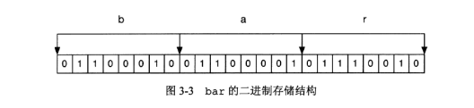

## Redis入门记录

### 0 OSX下安装

我是使用源代码编译的，首先，肯定是在官网上下载压缩包了，地址：[redis官网下载](https://redis.io/download)

也可以使用命令行进行下载，然后解压并进入文件夹执行make，这样redis就可以使用了，最后使用make install将环境添加到全局中，这样在任意位置都可以启动redis服务了。

```bash
//先下载好压缩包
$ tar xzf redis-4.0.10.tar.gz
$ cd redis-4.0.10
$ make
$ make install
```

### 1 Hello World

```javascript
redis-server	//启动服务，默认端口6379
redis-cli			//另开一个窗口启动客户端		
redis> //客户端开启后连接到服务器端的状态
redis> PING
PONG					//测试服务器是否能够连接上
```

简单的测试完成后，就正式的进入内容的学习了。

### 2 基础数据类型的操作

#### 2.1 string类型

```JavaScript
redis> set bar 1
OK								//设置一个字符串键值对
redis> get bar 
1									//根据键名的到相应的值
redis> exits bar 
(integer) 1				//判断一个键是否存在
redis> setnx bar 2
(integer) 0				//如果一个值不存在，则新建赋值，如果存在则不进行任何操作，nx=not exist
redis> setex haircolor 10 green
OK								//设置带过期时间的变量
redis> set email Y_Zhang@163.com
OK
redis> setrange email 8 gmail.com
(integer) 17			//范围替换，从第几个位置开始。
redis> getset email x@qq.com
"Y_Zhang@gmail.com"	//返回原来的值并设置新的值
redis> del bar 
(integer) 1				//删除一个键
redis> type bar 
string						//判断一个键值的数据类型
redis> set str "what?"
redis> append str " a?"
"what? a?"				//在字符串尾部添加东西
redis> strlen str
(integer) 8				//得到字符串的长度
redis> mset s1 hello s2 my s3 Friend s4 Im s5 pasha
OK
redis> mget s1 s2 s3 s4 s5
1) "hello"
2) "my"
3) "Friend"
4) "Im"
5) "pasha"				//multi 一次设置查询多个值
redis> keys *
"bar"							//根据条件查找到相应的键，*使用glob风格通配字符
```

##### 2.1.1 数字相关的操作

```javascript
redis> incr num
(integer) 1 			//如果是整数的话，可以让键值递增，并返回递增后的值，如果这个值不存在，默认为0
									//并且返回加一后的值1，当键值不是整数的时候会提示错误。
redis> set str "this is a string！"
redis> incr str 
(error) ERR value is not an  integer or out of range
redis> decr num 
(integer) 0 			//有自加肯定有自减嘛
redis> incrby num 5
(integer) 5 			//加一个特定的数字
redis> decrby num 2
(integer) 3				//有加还是有减
redis> incrbyfloat num 0.22
"2.22"						//加一个浮点数
redis> decrbyfloat num 1.232
(error) ERR unknown command 'decrbyfloat' //这个没减的命令。。
```

##### 2.1.2 位相关的操作

用位来存储bool值非常节省空间，相当于压缩了8倍。

```js
redis> set foo bar
OK
```

bar的3个字母对应的ASCII码分别为98、97和114,转换后的二进制分别为1100010、1100001和1110010，所以foo键中的二进制位结构入图：



```js
redis> getbit foo 0
(integer) 0					//得到某一位的值
redis> setbit foo 6 0
(integer) 1 				//设置某一位的值，返回值是该位原来的值
redis> bitcount foo
(integer) 10
redis> bitcount foo 0 1
(integer) 6					//得到字段中1的个数，也可以指定范围，这个范围是字节为单位的，即8bit。
redis> set foo1 bar
redis> set foo2 aar
redis> bitop or res foo1 foo2
(integer) 3 
redis> get res
"car"								//位或比较两个字符串，得到的值放入res，bar和aar的比较结果是car。
```

#### 2.2 Hash类型

hash类型比字符串类型，多了一层，更加像一个对象，先定义一个空间，内部是一个个键值对。十分适合用来存储对象类型。

```js
redis> hset car price 500
(integer) 1
redis> hset car name BMW
(integer) 1
redis> hget car name
"BMW"
//设置值和读取值，hset的命令不区分插入和更新操作，修改数据时，由程序来自动判断
//当返回1的时候是插入操作，返回0的是更新操作，都由程序自动完成
redis> hmset computer cpu i9 memory 128 power 600W
OK
redis> hmget computer cpu memory power
1) "i9"
2) "128"
3) "600W"
redis>
//一次操作多个字段
redis> hgetall car
1) "price"
2) "500"
3) "name"
4) "BMW"
//一次返回键中的所有字段和字段值
redis> hexists car model
(integer) 0
redis> hset car model C200
(integer) 1
redis> hexists car model
(integer) 1
//判断一个键中的字段是否存在，存在则返回1，不存在返回0
redis> hsetnx car onwer bill
(integer) 1
redis> hsetnx car onwer bill
(integer) 0
//当键中的字段不存在时，赋值，当存在时，什么都不做
redis> hincrby car year 5
(integer) 5
//同样是对数字的操作，但是不存在hincr方法
redis> hdel car year
(integer) 1
//删除某个字段
redis> hkeys car
1) "price"
2) "name"
3) "model"
4) "onwer"
redis> hvals car
1) "500"
2) "BMW"
3) "C200"
4) "bill"
//获取所有的keys， 以及获取所有的vals
```

#### 2.3 List类型

list的实现不是数组，而是双向链表。这样做自然是抛弃了索引和查询的性能，但是，假如以微博为例，我们看微博的时候只会看列表中自己没看过的最新的内容，而这些内容，在双向链表中的读取速度是极快的，因为它们在链表的头部，至于内部的内容，很少有人会关心了。适用list的数据主要是不关心内部到底存在了多少数据，以及很少读取链表中间的内容，大部分时间都是往内插入，并读取最新的内容。保证大多数时间的性能是极其优秀的。

由于redis不允许嵌套，所以list一般只是用来存id，根据id去存取。

```js
redis> lpush numbers 1 2 3 4 5
(integer) 5
redis> rpush numbers 0 -1 -2 -3
(integer) 9
redis> lrange numbers 0 -1
1) "5"
2) "4"
3) "3"
4) "2"
5) "1"
6) "0"
7) "-1"
8) "-2"
9) "-3"
redis> lpop numbers
"5"
redis> rpop numbers
"-3"
//l和r来对链表的左右端进行操作，push和pop来进行插入和弹出操作。压入的顺序和栈一样。
//lrange 左边第一个元素为0，右边最后一个元素为-1，[0, 1, ..., -2, -1]
redis> llen numbers
(integer) 7
//得到list的长度
redis> lrem numbers 1 -1
(integer) 1
redis> lrem number -1 3
(integer) 0
redis> lrange numbers 0 -1
1) "4"
2) "3"
3) "2"
4) "1"
5) "0"
6) "-2"
//lrem的参数(key, x, y)，当第一个值x大于0时从左边删除x个y,当x小于0时，从右边删除x个y。

//虽然索引可能性能一般，但是还是有用的
redis> lindex numbers 1
"3"
redis> lset numbers 1 20
OK
redis> lindex numbers 1
"20"
//得到特定位置的值，修改特定位置的值

redis> ltrim numbers 0 3
OK
redis> lrange numbers 0 -1
1) "4"
2) "20"
3) "2"
4) "1"
//ltrim修剪list，使用方法和lrange一样

redis> linsert numbers BEFORE 20 11111
(integer) 5
redis> linsert numbers AFTER 20 99999
(integer) 6
redis> lrange numbers 0 -1
1) "4"
2) "11111"
3) "20"
4) "99999"
5) "2"
6) "1"
//list的插入操作，根据val的值进行前后的插入。

//  rpoplpush source destination
// 和名字一样，从右边pop，左边push。
// 当source和destination相同时，它会不断地将队尾的元素移到队首，借助这个特性我们可以实现一个网站监控系统，使用一个队列存储需要监控的网址，然后监控程序不断地使用rpoplpush命令循环去除一个网址来测试可用性。这里使用rpoplpush命令的好处在于程序执行过程中仍然可以不断地向网址列表中加入新网址，而且整个系统容易扩展，允许多个客户端同时处理队列。
```

#### 2.4 set类型

set表示一个集合，集合中的元素都是唯一的。

```js
redis> sadd letters a b c a d c
(integer) 4
redis> smembers letters
1) "c"
2) "d"
3) "b"
4) "a"
redis> srem letters c d
(integer) 2
redis> smembers letters
1) "a"
2) "b"
// 添加删除以及查看
redis> sismember letters a
(integer) 1
// 是否有a，有返回1，没有返回0

//集合间的运算
redis> sadd setA 1 2 3 4
(integer) 4
redis> sadd setB 2 3 5 6
(integer) 4
redis> sadd setC 4 6 8
(integer) 3
redis> sdiff setA setB setC
1) "1"
redis> sdiff setC setB setA
1) "8"
// sdiff进行的差的比较 A-B-C   C-B-A
redis> sinter setA setC
1) "4"
redis> sunion setA setC
1) "1"
2) "2"
3) "3"
4) "4"
5) "6"
6) "8"
// sinter sunion 交集和并集
redis> scard setC
(integer) 3
// 获取集合中的元素个数

// sdiffstore destination key [key ...]
// sinterstore destination key [key ...]
// sunionstore destination key [key ...]
// 和前面的唯一区别是，结果放在了destination中用来继续运算而不是直接返回

redis> srandmember setA
"4"
redis> srandmember setA
"1"
redis> srandmember setA 3
1) "4"
2) "2"
3) "3"
redis> srandmember setA -3
1) "2"
2) "2"
3) "2"
// 随机从集合里取一个元素。 第二个参数，当大于0，取得数不可以相同，当小于0，可以相同。

redis> spop setA
"4"
redis> smembers setA
1) "1"
2) "2"
3) "3"
//随机从集合中弹出一个元素
```

#### 2.5 sorted set类型

有序的set嘛，就是有序，不重复，通过score来排序。

```js
redis> zadd scoreboard 89 Tom 67 Peter 100 David
(integer) 3						//添加
redis> zadd scoreboard 76 Peter
(integer) 0						//修改
redis> zadd testboard 17E+307 a
(integer) 1
redis> zadd testboard 1.5 b
(integer) 1
redis> zadd testboard +inf c
(integer) 1
redis> zadd testboard -inf d
(integer) 1
// score值可以是浮点数，可以是正数，可以是负数，可以是无穷。

redis> zscore scoreboard Tom
"89"
// 得到某个字段的score

redis> zrange scoreboard 0 -1 withscores
1) "Peter"
2) "76"
3) "Tom"
4) "89"
5) "David"
6) "100"
// zrange和lrange的用法差不多，这个排序是从小到大排的, withscores可选参数

redis> zadd test 0 aa 0 AA 0 33 0 "张杰 0" 0 "周杰伦" 0 "刘德华"
(integer) 6
redis> zrange test 0 -1
1) "33"
2) "AA"
3) "aa"
4) "\xe5\x88\x98\xe5\xbe\xb7\xe5\x8d\x8e"
5) "\xe5\x91\xa8\xe6\x9d\xb0\xe4\xbc\xa6"
6) "\xe5\xbc\xa0\xe6\x9d\xb0 0"
// 如果score相同，采用字典序排序
// 字典序： (0 < 9 < A < Z < a < z)
// 中文根据utf-8编码的值进行排序

// zrangebyscore key min max [withscores] [LIMIT offset count]
redis> zrangebyscore scoreboard 80 100
1) "Tom"
2) "David"
redis> zrangebyscore scoreboard 80 (100
1) "Tom"
// 基础用法，返回区间的值，如果不想包含端点的值，在值前面添加"(".
redis> zrangebyscore scoreboard (85 +inf withscores
1) "Tom"
2) "89"
3) "David"
4) "100"
// 支持无穷大无穷小

// 多添加一些数据
redis> zrange scoreboard 0 -1 withscores
 1) "Jerry"
 2) "56"
 3) "Yvonne"
 4) "67"
 5) "Peter"
 6) "76"
 7) "Tom"
 8) "89"
 9) "Wendy"
10) "92"
11) "David"
12) "100"
redis> zrangebyscore scoreboard 60 +inf LIMIT 1 3
1) "Peter"
2) "Tom"
3) "Wendy"
//从及格的人里面，从第二个人开始返回3个人。

//因为分数是从小到大排序的，对于想要查高分排名，需要用到 zrevrangebyscore
redis> zrevrangebyscore scoreboard 100 0 LIMIT 0 3
1) "David"
2) "Wendy"
3) "Tom"
// 本次比赛的前三名

redis> zincrby scoreboard 20 Jerry
"76"
// Jerry走后门，给他加了20分

redis> zcard scoreboard
(integer) 6
redis> zcount scoreboard 60 80
(integer) 3
// 计算总元素个数，   计算区间内元素个数

redis> zrem scoreboard David
(integer) 1
// David作弊，取消比赛资格。 删除它

redis> zadd testRem 1 a 2 b 3 c 4 d 5 e 6 f 7 g
(integer) 7
redis> zremrangebyrank testRem 0 2
(integer) 3
// 删除前三名 (从小到大排的)。
redis> zremrangebyscore testRem (6 7
(integer) 1
// 按分数删除

redis> zrank scoreboard Jerry
(integer) 1
redis> zrevrank scoreboard Jerry
(integer) 3
// 从小到大和从大到小的排序

// zinterstore destination numkeys [keys...] [WEIGHTS weight [weight...]] [AGGREGATE SUM|MIN|MAX]
// 存放结果的地方， 几个集合， 每个集合的权重， AGGREGATE处理的方式，相加取最小或者取最大，和weight有关
// zunionstore 用法同 zinterstore
```

### 3 Redis 进阶概念

#### 3.1 transaction(事务)

transaction是一组命令的集合。事务和命令一样具有原子性，事务中的命令要么全都执行，要不全都不执行。比如，支付宝转账，A转给B，先从A中扣钱，在给B加钱，这两个步骤属于同一个事务，如果只执行第一步，钱就丢了，显然无法接受，所以两个步骤必须全都执行，或者全都不执行，这就是一个事务。

比如微博中的关注，A关注了B，A的following中多了B，B的follower中多了A，这属于事务，不可分解。

```js
redis> MULTI
OK
redis> sadd "user:1:following" 2
QUEUED
redis> sadd "user:2:follower" 1
QUEUED
redis> EXEC
1) (integer) 1
2) (integer) 1
// 用MULTI告诉redis接下来执行的将会是事务，EXEC来统一执行事务。
```

##### 3.1.1 transaction的错误处理

**语法错误**：

```js
redis> MULTI
OK
redis> set time 20180716
QUEUED
redis> set time
(error) ERR wrong number of arguments for 'set' command
redis> adfadfs sdf
(error) ERR unknown command 'adfadfs'
redis> EXEC
(error) EXECABORT Transaction discarded because of previous errors.
```

事务中的任意一条语法错误会使整个事务报错，不会执行。

**运行错误**：

```js
redis> MULTI
OK
redis> set key 1
QUEUED
redis> sadd key 2
QUEUED
redis> set key 3
QUEUED
redis> EXEC
1) OK
2) (error) WRONGTYPE Operation against a key holding the wrong kind of value
3) OK
```

当语法不存在错误，但是比如你使用操作set的方法去操作string类型的数据会在运行时报错。

运行时错误除了出错的那一条不执行，其他的正确的命令都会执行，这就会导致很多问题，需要开发者自己注意。

##### 3.1.2 WATCH命令

定义：WATCH命令可以监控一个或者多个键，一旦其中有一个键被修改(或删除)，之后的事务就不会执行。监控一直持续到EXEC命令，所以在EXEC命令后可以修改WATCH监控的数据。

```js
redis> set key 1
OK
redis> WATCH key
OK
redis> set key 2
OK
redis> MULTI
OK
redis> set key 110
QUEUED
redis> EXEC
(nil)
```

测试了很多种情况，只有这种情况是不可以修改的，也就是说，如果在MULTI外改变了WATCH的key值，在MULTI内部就不可以对WATCH的值进行操作了，如果WATCH的值在MULTI外部没有改变，那么在内部就可以操作key，最后EXEC会取消对key的WATCH，这样通过WATCH和事务，就可以保证在事务中只能操作被WATCH的未被改变的数据，如果数据在执行事务之前被改变了，则不可以操作。

#### 3.2 生存时间

生存时间可以用来控制一定时间内的访问量，也可以用来设置缓存的过期时间。

```js
redis> set foo bar
OK
redis> expire foo 30
(integer) 1
redis> ttl foo
(integer) 24
redis> ttl foo
(integer) 15
redis> ttl foo
(integer) -2
redis> get foo
(nil)
redis> set fooo 1
OK
redis> ttl fooo
(integer) -1
// expire可以给一个元素添加过期时间，单位是秒，时间到了该元素就会被删除不存在，ttl可以看到过期时间，如果已经不存在(即已经过期)，返回-2，如果一个元素没有设置过期时间返回-1。

redis> set foo 123
OK
redis> expire foo 30
(integer) 1
redis> ttl foo
(integer) 27
redis> persist foo
(integer) 1
redis> ttl foo
(integer) -1
// 使用persist可以取消生存时间，使用set也会清除生存时间，但是(incr，lpush，hset，zrem)等操作不会影响生存时间，应该是ttl挂在变量名下，set会重置变量地址，其他操作不会。
```


