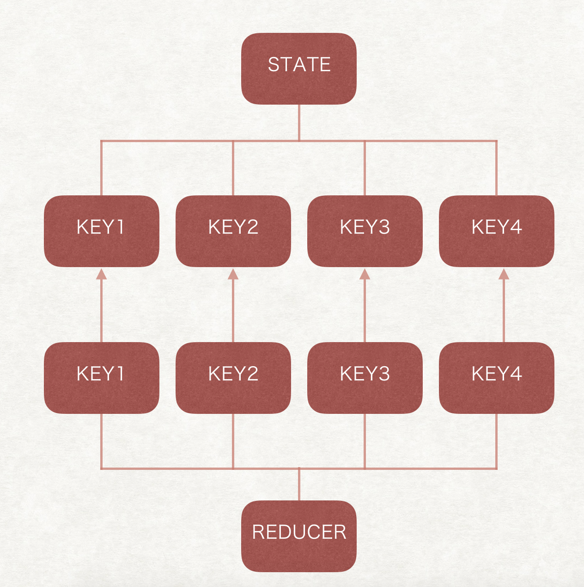
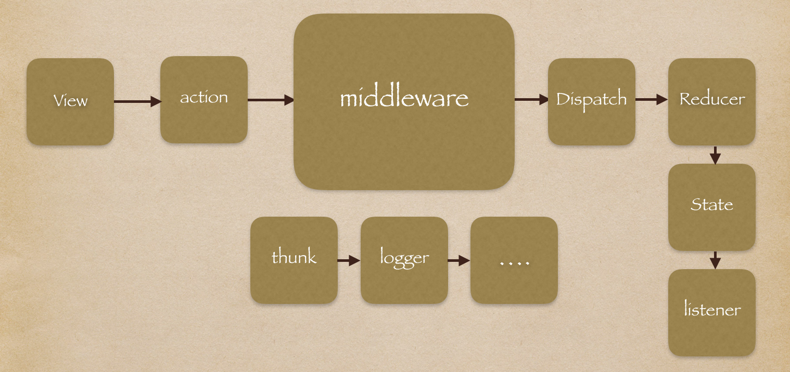

------

## 1. Redux基础概念

**Action、Reducer、State、Store**
整个redux的数据流通是严格单向的，state是一棵状态树，用来存放项目中的一些数据，action相当于一个命令，reducer就相当于一个命令接收器，通常是由store.dispatch发出一个action，由reducer接收，reducer相当于命令的执行者，根据actionType去改变store中的state。
Store作为redux中的核心，它提供以下几个常用方法：

- getState()  返回store中存放的state状态树
- dispatch(state, action)  用来派发action
- subscribe(listener)  注册监听事件，当state改变后会调用listener函数。

action是一个普通的js对象，一个action中，必备的是actionType，reducer需要根据actionType去判断该执行什么方法。

```javascript
{
  type: ADD
}
```

可选的是一些参数，当我们需要reducer处理更加复杂的操作时，我们就需要在action里添加一些参数，比如：

```javascript
{
  type: ADD_WEIGHT,
  weight: 20
}
```

此时有了action，那么就可使用store.dispatch去发送一个命令了

```javascript
store.dispatch({
  type: ADD_WEIGHT,
  weight: 20
})
```

Action的接收是由reducer完成的，reducer是一个函数，它接收state和action作为参数，并根据action对state进行修改并返回新的state，这样一次对state中特定数据的一次操作就完成了。

```javascript
//reducer function
function (state, action) {
  switch (action.type) {
    case ADD_WEIGHT:
      return [...state, weigth: state.weight + action.weight]
    default:
      return state
  }
}
```

注意：在reducer中对state的任何操作都不应该直接修改state本身的值，因为在redux对执行前后的state进行比较的时候使用的是shallowEqual，也就是只比较数据的地址，如果你直接对state中的数组、对象等数据进行操作，数据是改变了，但是并不会使页面进行刷新。所以我们需要避免这种情况的出现。并且我们在将数据复制出来操作的时候，需要从state的第一层开始复制。

## 2. Redux源码解析

### 2.1 createStore

#### 2.1.1 mini CreateStore

Store是redux中一个特别重要的对象，它提供了getState(), dispatch(),以及subscribe()等方法，那么我们可以根据已有的知识搭建我们自己的redux源码了。
首先，我们知道store会提供以上三种方法，那么一个store对象就包含了

```javascript
store = {
  getState,
  dispatch,
  subscribe
}
```

createStore是用来创建store的，自然它的返回值应该是store对象。它的参数应该有哪些呢，我们去改变store中的state需要action和reducer的配合，action作为dispatch的参数，是在使用store.dispatch时传入的，所以，构建store的时候只需要将reducer传入即可。此时我们在函数内部还需要定义几个变量：

- state  保存我们的状态树
- listeners  保存订阅者函数的数组

```javascript
function createStore(reducer) {
  let state = {}
  let listeners = []
  return { 
    getState,
    dispatch,
    subscribe
  }
}
```

一个createStore的基础框架就完成了，此时几个重要的函数还没有完成。
getState如你想象的一样简单，就是返回state
`function getState() { return state }`
subscribe是一个订阅函数，显然他的功能就是讲传进来的listener参数放入我们所定义好的listeners数组中即可。注意，当我们订阅一个事件时不要忘记了在不需要的时候取消订阅，所以subscribe函数还应该提供一个取消订阅的方法。

```javascript
function subscribe(listener) {
  listeners.push(listener)
  return function unsubscribe() {
    const index = listeners.indexOf(listener)
	  listeners.splice(index, 1)
  }
}
```

dispatch应该是一个接收action作为参数并且调用reducer去对state进行操作的函数，注意，我们的订阅者们希望在state改变的时候触发他们，所以我们需要在reducer改变state后调用listenners。

```javascript
function dispatch(action) {
  state = reducer(state, action)
  listeners.forEach(listener => listener())
  return action
}
```

一个createStore函数的基本构建就几近完成了，最后还需要初始化state的数据结构，就是我们在reducer中定义的inintialState `dispatch({ type: ActionTypes.INIT })`。
所以一个createStore的整体功能就完成了。

```javascript
function createStore(reducer) {
  let state = {}
  let listeners = []

  function getState() { return state }

  function subscribe(listener) {
    listeners.push(listener)
    return function unsubscribe() {
      const index = listeners.indexOf(listener)
        listeners.splice(index, 1)
    }
  }

  function dispatch(action) {
      state = reducer(state, action)
      listeners.forEach(listener => listener())
      return action
  }

  dispatch({ type: ActionTypes.INIT })
  return { 
    getState,
    dispatch,
    subscribe
  }
}
```

### 2.1.2 createStore.js源代码

我们自己实现的麻雀确实是五脏俱全了，但是也就在树上飞一下了，用在很大的项目中，显然是不可行了，我们再去看看createStore中的源码实现。

```javascript
//这里有三个参数，第一个是reducer，可以使一个reducer，也可以是经过combineReducer后的结果， preloadedState用来初始化state结构的，enhancer是用来添加一些额外功能用的，包括中间件以及一些调试工具
export default function createStore(reducer, preloadedState, enhancer) {
//当第二个参数是函数的时候，preloadedState实际上被忽略了，只传入了enhancer，此时调整一下参数。
  if (typeof preloadedState === 'function' && typeof enhancer === 'undefined') {
    enhancer = preloadedState
    preloadedState = undefined
  }
//enhancer存在的话，使用enhancer来创建store，并给store添加功能
  if (typeof enhancer !== 'undefined') {
    if (typeof enhancer !== 'function') {
      throw new Error('Expected the enhancer to be a function.')
    }
    return enhancer(createStore)(reducer, preloadedState)
  }

  if (typeof reducer !== 'function') {
    throw new Error('Expected the reducer to be a function.')
  }

  let currentReducer = reducer
  let currentState = preloadedState
  let currentListeners = []
  let nextListeners = currentListeners
  let isDispatching = false

//这个函数的功能和他写的名字差不多，确保在遍历调用listener的时候，新的listener可以加入,使用slice方法确保数组进行了深复制，他们指向的地址是不同的，所以在修改nextListeners时，currentListeners是不会受到影响的
  function ensureCanMutateNextListeners() {
    if (nextListeners === currentListeners) {
      nextListeners = currentListeners.slice()
    }
  }

  function getState() {
    if (isDispatching) {
      throw new Error(
				//删了大段错误提示
      )
    }
    return currentState
  }

  function subscribe(listener) {
    if (typeof listener !== 'function') {
      throw new Error('Expected the listener to be a function.')
    }
    if (isDispatching) {
      throw new Error(
        //删了大段错误提示
      )
    }
    let isSubscribed = true
    ensureCanMutateNextListeners()
    nextListeners.push(listener)
    return function unsubscribe() {
      if (!isSubscribed) {
        return
      }
      if (isDispatching) {
        throw new Error(
					//删了大段错误提示
        )
      }
      isSubscribed = false
      ensureCanMutateNextListeners()
      const index = nextListeners.indexOf(listener)
      nextListeners.splice(index, 1)
    }
  }

  function dispatch(action) {
    if (!isPlainObject(action)) {
      throw new Error(
        'Actions must be plain objects. ' +
          'Use custom middleware for async actions.'
      )
    }

    if (typeof action.type === 'undefined') {
      throw new Error(
        'Actions may not have an undefined "type" property. ' +
          'Have you misspelled a constant?'
      )
    }

    if (isDispatching) {
      throw new Error('Reducers may not dispatch actions.')
    }

    try {
      isDispatching = true
      currentState = currentReducer(currentState, action)
    } finally {
      isDispatching = false
    }

    const listeners = (currentListeners = nextListeners)
    for (let i = 0; i < listeners.length; i++) {
      const listener = listeners[i]
      listener()
    }

    return action
  }

  /**
   * Replaces the reducer currently used by the store to calculate the state.
   **/
  function replaceReducer(nextReducer) {
    if (typeof nextReducer !== 'function') {
      throw new Error('Expected the nextReducer to be a function.')
    }
    currentReducer = nextReducer
    dispatch({ type: ActionTypes.REPLACE })
  }

  function observable() {
    const outerSubscribe = subscribe
    return {
      subscribe(observer) {
        if (typeof observer !== 'object' || observer === null) {
          throw new TypeError('Expected the observer to be an object.')
        }

        function observeState() {
          if (observer.next) {
            observer.next(getState())
          }
        }

        observeState()
        const unsubscribe = outerSubscribe(observeState)
        return { unsubscribe }
      },

      [$$observable]() {
        return this
      }
    }
  }
  dispatch({ type: ActionTypes.INIT })

  return {
    dispatch,
    subscribe,
    getState,
    replaceReducer,
    [$$observable]: observable
  }
}
```

为什么会有currentListeners和nextListeners，以及ensureCanMutateNextListeners()：
在dispatch中，需要调用每个listener函数的时候，会从nextListeners更新currentListeners，在执行的时候，实际上是遍历currentListeners这个数组，在添加和删除的时候，操作的是nextListeners。并且在ensureCanMutateNextListeners中，如果两个数组的地址是一样的，会使用slice进行深拷贝让他们互不影响，这样做的主要目的是，遍历数组并执行每个函数的时候，可以继续对数组进行操作而相互之间不影响。

关于**ActionTypes.INIT**

```javascript
Math.random()
    .toString(36)
    .substring(7)
    .split('')
    .join('.')
const ActionTypes = {
  INIT: `@@redux/INIT${randomString()}`,
}
```

我们之前说，reducer会根据action去执行特定的方法，这个随机函数显然是不想让reducer中的switch命中，这时候恍然大悟，我们自己定义的action都会有相应的reducer处理，什么时候reducer中的default才会命中呢，此时，INIT就被会default命中。它什么也不做，只是返回state，而此时的state是我们在上面定义的一个空对象，此时reducer中state的默认值就会代替空对象返回，所以 `dispatch({ type: ActionTypes.INIT })`会初始化所有的reducer。

### 2.2 combineReducers

首先，我们知道combineReducers的作用是用来将多个reducer合并成一个大的reducer，并作为参数传进createStore，那么我们来手动实现一个简单的combineReducer。

```javascript
const combineReducer = (reducers) => {
  return (state = {}, action) {
    return Object.keys(reducers).reduce(
      (nextState, key) => {
        nextState[key] = reducers[key](
        	state[key],
          action
        )
        return nextState
      },
      {}
    )
  }
}

const rootReducer = combineReducers({
    theDefaultReducer,
    firstNamedReducer,
    secondNamedReducer
});
```

实现起来非常的简单，函数接收一个reducers对象作为参数，每一个独立的reducer都有一个唯一的key值，它在state中也有唯一的一个key相对应，通过reduce函数将多个reducer处理的结果合并，这样实际上存在的多个reducer对应的state就会被一个根节点给组织起来，在逻辑上我们看到的外部只有一个reducer，实际上内部还是独立的，只是他们都挂载在同一个根节点上，此时的state和reducer中的key是完全一样的。当接收到action的时候，reducers会遍历自身的所有子reducer去匹配action。reducer只会根据自己key去操作相应key的state。



### 2.3 compose

#### 2.3.1 柯里化函数(curry)

在计算机科学中，柯里化(Currying)是把接受多个参数的函数变换成接受一个单一参数（最初函数的第一个参数）的函数，并且返回接受余下的参数而且返回结果的新函数的技术。这个技术由克里斯托弗·斯特雷奇以逻辑学家哈斯凯尔·加里命名的。

我们用一个最简单的例子来看看柯里化的实现：

```javascript
function add(a, b) {
  return a + b
}
add(3, 4)

//currying
function add(a) {
  return function(b) {
    return a + b
  }
}
add(3)(4)
```

这样我们就能很清晰的明白，柯里化实际上就是当一个函数可能接受多个参数时，我们每次只接受一个参数，并且返回接收剩下参数的函数，并且由于闭包的存在，我们可以再函数的最内部访问到外层所有输入参数。那么这样写有什么意义呢？柯里化的一些作用包括：延迟计算、参数复用、动态生成函数的作用。

```javascript
function add(a) {
  return function(b) {
    return a + b
  }
}
//利用add函数，我们可以创建+1和-1两个新函数。
const increment = add(1)
const decrease = add(-1)

increment(20)
// 21
decrease(19)
//20

//一个正则表达式
const match = function (reg) {
  return function (str) {
    return str.match(reg)
  }
}
//创建了一个新的函数，可以判断一个字符串是否含有空格
const hasSpace = match(/\s+/g)

hasSpaces("hello world");
// [ ' ' ]

hasSpaces("spaceless");
// null

```

#### 2.3.2 代码组合compose

我们来看一下代码组合的基本定义：

```javascript
var compose = function(f,g) {
  return function(x) {
    return f(g(x));
  };
};

var toUpperCase = function(x) { return x.toUpperCase(); };
var exclaim = function(x) { return x + '!'; };
var shout = compose(exclaim, toUpperCase);

shout("what happen");
//=> "WHAT HAPPEN!"
```

可以看到，函数是从右向左依次执行的，这样做的好处是，当我们对一个变量多个函数进行多次操作时，不需要处理重复的嵌套，只需要将函数作为参数传入即可，如果有顺序上的要求，则需要从右向左排列。

#### 2.3.3 compose.js源代码

函数非常的简洁，它利用reduce函数，a作为accumulate放在了函数的外层，所以funcs数组的执行顺序也是从右往左的。

```javascript
export default function compose(...funcs) {
  if (funcs.length === 0) {
    return arg => arg
  }

  if (funcs.length === 1) {
    return funcs[0]
  }

  return funcs.reduce((a, b) => (...args) => a(b(...args)))
}
```


### 2.4 applyMiddleware

#### 2.4.1 一个简单的middleware

在了解applyMiddleware之前，我们先看一个简单的中间件的实现，一共是3层嵌套，第一层接收store作为参数，通过store我们可以获取state以及dispatch，next是下一个函数，相当于`f(g(x))`中f()收到的next参数就是`g(x)`，action是最后传入的参数，就相当于那个x。

再来看一个logger的实现，它就是截取到action，dispatch直接打印state状态，并且在dispatch后再打印一遍新的状态。

```javascript
/**
 * 记录所有被发起的 action 以及产生的新的 state。
 */
const logger = store => next => action => {
  console.group(action.type)
  console.log('prev state', store.getState())
  console.info('dispatching', action)
  let result = next(action)
  console.log('next state', store.getState())
  console.groupEnd(action.type)
  return result
}
```

#### 2.4.2 applyMiddleware.js源代码

再来看applyMiddleware的源码，主要作用是将第三方middleware加入到store的中dispatch来增加一些新的功能，它利用了我们上面所提到的compose代码组合来将所有的middleware组合成一个整体。

```javascript
export default function applyMiddleware(...middlewares) {
  return createStore => (...args) => {
    //在createStore中，我们知道如果enhancer存在，那么实际上createStore以及它的参数都被传入了enhancer，在这里用传进来的参数创建了store
    const store = createStore(...args)
    let dispatch = () => {
      throw new Error(
        `Dispatching while constructing your middleware is not allowed. ` +
          `Other middleware would not be applied to this dispatch.`
      )
    }
		//这里把store中的方法传给middleware
    const middlewareAPI = {
      getState: store.getState,
      dispatch: (...args) => dispatch(...args)
    }
    const chain = middlewares.map(middleware => middleware(middlewareAPI))
    //将所有的middleware组合，合并成一个新的函数赋给store中的dispatch，完成功能的扩展
    dispatch = compose(...chain)(store.dispatch)

    return {
      ...store,
      dispatch
    }
  }
}
```

### 2.5 bindActionCreators

#### 2.5.1 actionCreator

关于actionCreator，我们为什么要使用它呢？

这是一个正常的redux action：

```javascript
{
  type: 'CREATE_PERSON',
  name: 'Koduck',
  age: 18,
  weight: 16
}
```

看起来没什么问题，但是如果每次在dispatch的时候你都要手动去写这样一个对象，显然是很蠢的，这个时候就需要actionCreator来帮我们生成一个action对象，而我们只需要调用函数传参就可以获得一个action对象：

```javascript
function createPerson(name, age, weight) {
  return {
    type: 'CREATE_PERSON',
  	name: name,
  	age: age,
  	weight: weight
  }
}

createPerson('Koduck', 18, 16)
```

这样我们就免去了手写action的麻烦，并且这样有利于代码的复用。

#### 2.5.2 bindActionCreators.js

那么这个文件到底有什么用呢，我们发现他只是将dispatch和action绑定在了一起并赋给了一个新的函数，调用该函数将直接派发一个新的action。

那么啥时候才应该使用它呢，官方给出的解释：

> The only use case for `bindActionCreators` is when you want to pass some action creators down to a component that isn't aware of Redux, and you don't want to pass [`dispatch`](https://redux.js.org/api-reference/store#dispatch) or the Redux store to it.

大概意思就是，当你的子组件并不关心redux，而且你也不想把store内的方法向下传递，而子组件只想得到一个派发action的接口去掉用，并不想知道内部的具体实现，这种实现方式就很好。

```javascript
// 返回了一个绑定了dispatch的action，调用该函数将直接派发一个action
function bindActionCreator(actionCreator, dispatch) {
  return function() {
    return dispatch(actionCreator.apply(this, arguments))
  }
}

export default function bindActionCreators(actionCreators, dispatch) {
  //当actionCreators是一个函数的时候，直接调用bindActionCreator
  if (typeof actionCreators === 'function') {
    return bindActionCreator(actionCreators, dispatch)
  }

  if (typeof actionCreators !== 'object' || actionCreators === null) {
    throw new Error(
			//删了大段错误提示
    )
  }
	//当actionCreators是一个对象时，我们遍历它的key，对每个actionCreator调用bindActionCreator
  const keys = Object.keys(actionCreators)
  const boundActionCreators = {}
  for (let i = 0; i < keys.length; i++) {
    const key = keys[i]
    const actionCreator = actionCreators[key]
    if (typeof actionCreator === 'function') {
      boundActionCreators[key] = bindActionCreator(actionCreator, dispatch)
    }
  }
  return boundActionCreators
}
```

### 3. 总结

redux的存在帮助我们完成了react项目中的数据处理以及维护，实现了组件间的数据共享,通过dispatch(action)的方式保证了数据的安全性。



由于redux中数据是严格单向流动的，承担着view --> model的数据流动，那么一次修改state的流程可以概括为：

1. view界面进行操作派发一个action
2. action进入中间件进行处理
3. action进入store.dispatch
4. store中的reducer收到action，根据action对state进行修改
5. 修改完成返回新的state
6. 执行listeners数组中的所有订阅函数

## 4. 参考资料

[redux中文文档](http://www.redux.org.cn/)

[redux作者的redux学习教程](https://egghead.io/lessons/react-redux-the-single-immutable-state-tree)

[redux源代码](https://github.com/reduxjs/redux)

[关于函数式编程的gitbook](https://legacy.gitbook.com/book/llh911001/mostly-adequate-guide-chinese/details)

[柯里化函数](https://github.com/MrErHu/blog/issues/8)