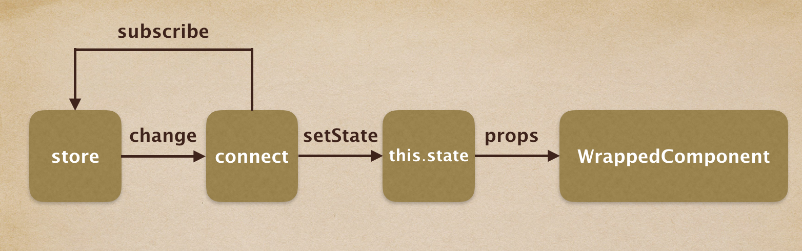
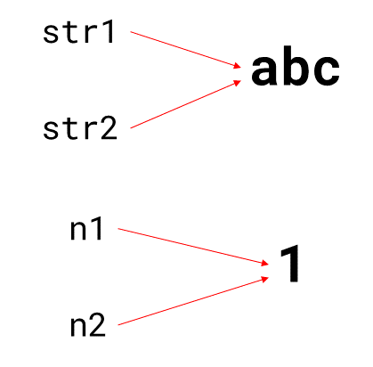
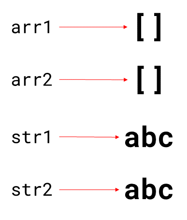
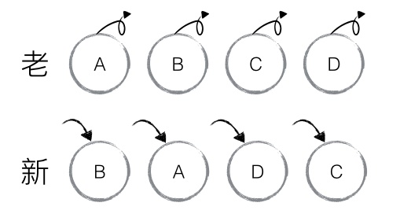
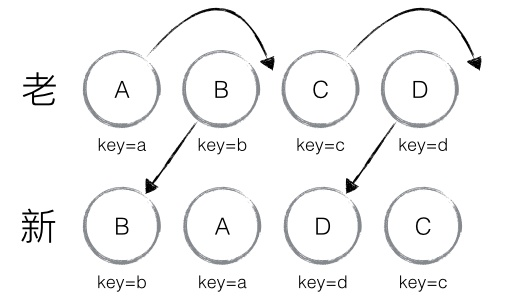
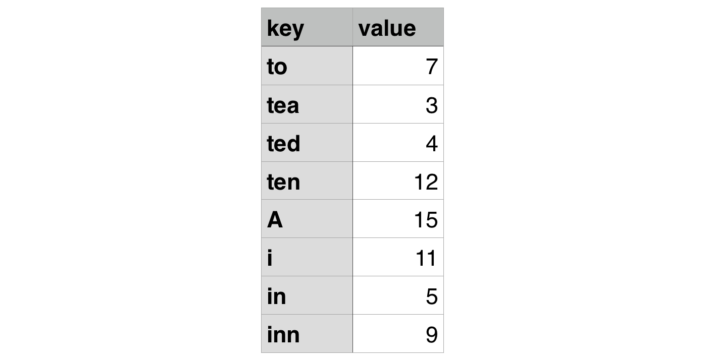
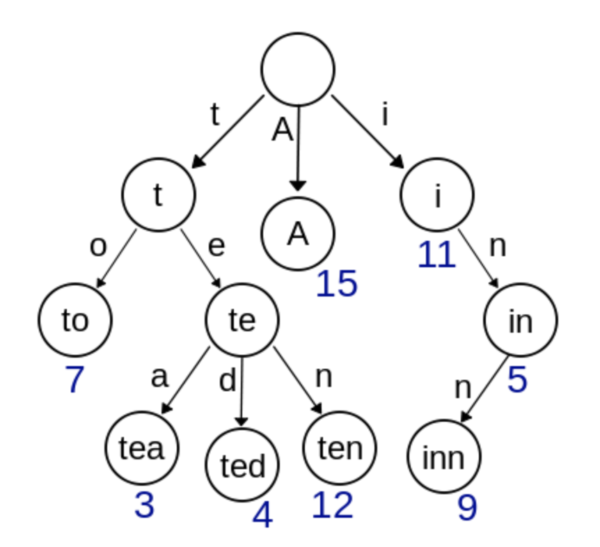
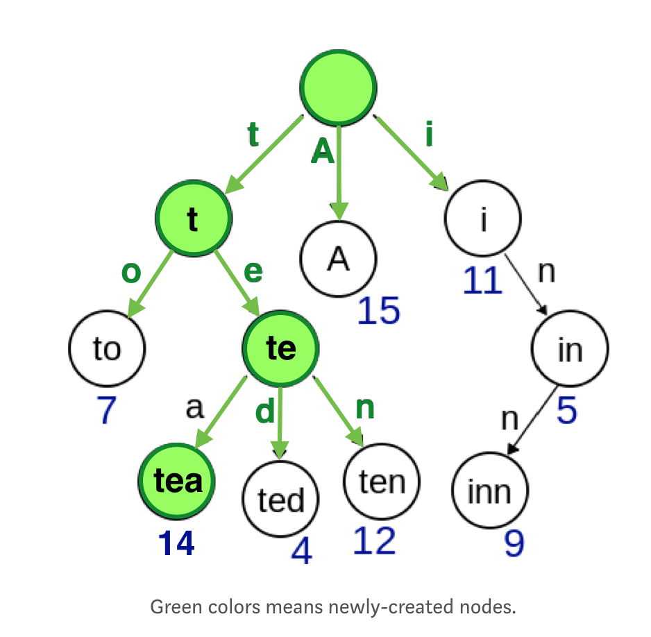
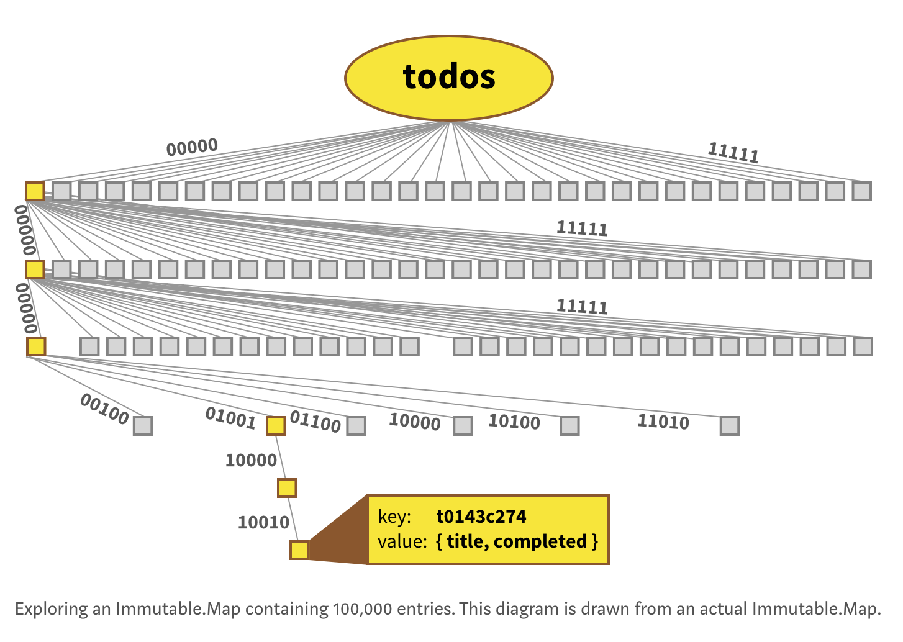
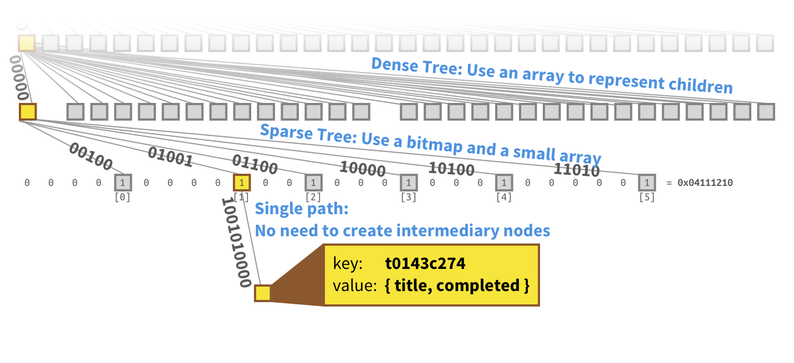

## 1. react-redux

React是个实现界面的框架，redux是进行状态管理的库，他们之间没有任何的关系，如果想同时使用他们，我们就还需要使用react-redux库来进行关联。

### 1.1 容器组件和展示组件

**什么是容器组件和展示组件呢？**

容器组件是和redux直接关联的外层组件，它需要对数据进行处理和操作，派发新的action，与服务器交互等功能，只关心数据处理的逻辑，并不关心数据是如何展示以及页面是如何实现的。

展示组件是用来实现界面的，它只关注页面的外观、如何根据数据生成页面以及根据容器组件提供的方法添加交互事件，并不关心背后数据处理的逻辑。

|                |          展示组件          |              容器组件              |
| :------------: | :------------------------: | :--------------------------------: |
|      作用      | 描述如何展现（骨架、样式） | 描述如何运行（数据获取、状态更新） |
| 直接使用 Redux |             否             |                 是                 |
|    数据来源    |           props            |          监听 Redux state          |
|    数据修改    |   从 props 调用回调函数    |       向 Redux 派发 actions        |
|    调用方式    |            手动            |      通常由 React Redux 生成       |

**这样架构有什么优点呢？**

- 更加低的耦合性，分离性更好，分工更明确，配合更容易。
- 更好的复用性。你可以用同一套容器组件获取数据，而使用不同的展示组件去展示，比如react实现web端，react-native实现手机端，他们可以使用同一套容器组件。相反你也可以用同一套展示组件去展示不同容器组件的数据。

### 1.2 Provider 

Provider作为整个应用数据的载体，先来看一下它的用法：

```javascript
ReactDOM.render(
  <Provider store={store}>
    <App />
  </Provider>,
  root
)
```

store就是redux中createStore生成的store对象，他被放进了Provider的props，并在包在了整个程序的最外层。这样我们的应用内的任何地方都可以获取到这个这个store对象，那么它是如何实现的呢，我们首先了解一下react中的context。

#### 1.2.1 context

> **context**：Context provides a way to share values like these between components without having to explicitly pass a prop through every level of the tree.

 相当于一个程序中的全局变量，我们知道数据在组件间是只能以props的方式向下传递的，如果一个变量在组件内各个层级被反复调用，传递props是很麻烦的(cumbersome)，此时使用context我们就可以像使用全局变量一样在内部直接调用，当然全局变量会让开发变得更加难以控制，所以我们只在这里使用到它。

#### 1.2.2 Provider.js源代码

```javascript
export function createProvider(storeKey = 'store') {
    const subscriptionKey = `${storeKey}Subscription`

    class Provider extends Component {
      	//在这里得到子组件的context环境，并把store设置为全局变量
        getChildContext() {
          return { [storeKey]: this[storeKey], [subscriptionKey]: null }
        }

        constructor(props, context) {
          super(props, context)
          //<Provider store={store}>
          this[storeKey] = props.store;
        }

        render() {
          return Children.only(this.props.children)
        }
    }

    if (process.env.NODE_ENV !== 'production') {
      Provider.prototype.componentDidUpdate = function () {
        if (this[storeKey] !== this.props.store) {
          warnAboutReceivingStore()
        }
      }
    }

    Provider.propTypes = {
        store: storeShape.isRequired,
        children: PropTypes.element.isRequired,
    }
  	//这一步很重要，不显式指定全局变量的类型，在子组件中是无法获取到该变量的
    Provider.childContextTypes = {
        [storeKey]: storeShape.isRequired,
        [subscriptionKey]: subscriptionShape,
    }

    return Provider
}
```

Provider作为一个高阶组件，接收store作为props，并且把store放在了context中，包裹在接收到的组件中，为子组件提供store对象。

### 1.3 Connect

Connect也是一个高阶组件,一共接收4个参数：

- `mapStateToProps(state, [ownProps])` (*Function*): 如果定义该参数，组件将会监听 Redux store 的变化。任何时候，只要 Redux store 发生改变，`mapStateToProps` 函数就会被调用。该回调函数必须返回一个纯对象，这个对象会与组件的 props 合并。
- `mapDispatchToProps(dispatch, [ownProps]): dispatchProps`(*Object* or *Function*): 如果传递的是一个对象，那么每个定义在该对象的函数都将被当作 Redux action creator，对象所定义的方法名将作为属性名；每个方法将返回一个新的函数，函数中`dispatch`方法会将action creator的返回值作为参数执行。这些属性会被合并到组件的 props 中。
- [`mergeProps(stateProps, dispatchProps, ownProps): props`] (*Function*): 如果指定了这个参数，`mapStateToProps()` 与 `mapDispatchToProps()` 的执行结果和组件自身的 `props` 将传入到这个回调函数中。该回调函数返回的对象将作为 props 传递到被包装的组件中。
- [`options`] *(Object)* 如果指定这个参数，可以定制 connector 的行为。
  - [`pure = true`] *(Boolean)*: 如果为 true，connector 将执行 `shouldComponentUpdate` 并且浅对比 `mergeProps` 的结果，避免不必要的更新。
  - [`withRef = false`] *(Boolean)*: 如果为 true，connector 会保存一个对被被包含的组件实例的引用，该引用通过 `getWrappedInstance()` 方法获得。*默认值为 false。*

```javascript
connect([mapStateToProps], [mapDispatchToProps], [mergeProps], [options])
```

平时最常用的就是前两个参数，它会把我们所需要的state和dispatch从store里面拿出并作为props传递给被connect的容器组件。这样就可以在子组件中得到state并且进行相关操作了。

#### 1.3.1 connect核心代码

connect的源码过于庞大，我们在这里只放了一些核心的代码

```javascript
export default function connect(mapStateToProps, mapDispatchToProps, mergeProps, options = {}) {
  return function wrapWithConnect(WrappedComponent) {
    class Connect extends Component {
      constructor(props, context) {
        // Provider在最外层，从Provider处获得store
        this.store = props.store || context.store
        this.stateProps = computeStateProps(this.store, props)
        this.dispatchProps = computeDispatchProps(this.store, props)
        this.state = { storeState: null }
        // 对stateProps、dispatchProps、parentProps进行合并
        this.updateState()
      }
      shouldComponentUpdate(nextProps, nextState) {
        // 进行判断，当数据发生改变时，Component重新渲染
        if (propsChanged || mapStateProducedChange || dispatchPropsChanged) {
          this.updateState(nextProps)
            return true
          }
        }
        componentDidMount() {
          // 改变Component的state
          this.store.subscribe(() = {
            this.setState({
              storeState: this.store.getState()
            })
          })
        }
        render() {
          // 生成包裹组件Connect
          return (
            <WrappedComponent {...this.nextState} />
          )
        }
      }
      Connect.contextTypes = {
        store: storeShape
      }
      return Connect;
    }
  }

```

整个Connect内部的逻辑为：

- 通过context得到Provider中的store对象
- props包括stateProps、dispatchProps、parentProps,合并在一起得到nextState，作为props传给真正的Component
- componentDidMount时，添加事件this.store.subscribe(this.setState)，当store中的数据发生改变时，会重新设置state，引发此组件的更新，而这个state作为子组件的props会触发子组件的更新
- shouldComponentUpdate时判断是否有避免进行渲染，提升页面性能，并得到nextState

### 1.4 Model-->View

在redux中，我们知道了从View到Model的数据传递，现在我们再来看一下从Model到View的数据传递。



首先在connect中订阅store，当store内的state发生变化，也就是任意组件dispatch(action)并进行了数据更新，我们在connect方法中就能得到一份更新后的store，当数据更新以后，我们将新的store.state通过setState的方法传递给connect组件使组件得到更新，此时会调用[mapStateToProps], [mapDispatchToProps],并且与本身的onwProps合并，以props的方式传递给子组件，子组件在props变化后会触发自己相应的update生命周期使页面进行刷新。

## 2. reselect

reselect库可以创建可记忆的(Memoized)、可组合的 **selector** 函数。Reselect selectors 可以用来高效地计算 Redux store 里的衍生数据。

### 2.1 reselect简介

**为什么需要reselect？**

假如我们现在有一个猪场🐖，他的数据如下：

```js
Pigs = [{
          id: 0,
          weight: 60,
         },
         {
          id: 1,
          weight: 56,
         },
          ...
        ]
```

然后我们有另外一个数组用来存放打算屠宰的🐷的id：

```js
killingPigs = [1, 3, 8, ...]
```

如果一斤猪肉20块，那么我们想要知道准备杀掉的这些🐷一共能卖多少钱，正常情况下我们需要根据已有的数据计算：

```js
//根据id拿到🐷的重量数据
const getWeight = (id) => Pigs.find((pig) => (pig.id === id)).weight
const money = killingPigs.reduce((acc, id) => (
  acc + getWeight(id) * 20
), 0)
```

这样我们就知道这些🐷能卖多少钱了，但是有一个问题出现了，我们每次操作导致页面更新都会重新计算这个价钱，如果killingPigs数组并没有改变，那么肯定卖出的钱也是不变的，只有在killingPigs数组新加入🐷或者移除🐷的时候，相应的价格才会改变，如果这个猪场是一个大厂，比如网易，那么可能就有几万几十万头，每次刷新都计算一遍非常的耗时，那么我们可不可以只在killingPigs数组改变的时候才进行计算而其他时候只返回原来算好的值呢，显然，reselect就是干这事的。

那么看一下它的使用：

```js
//inputSelectors可以是n个参数，也可以是一个数组，
//resultFunc根据inputSelectors给出的参数进行相应的计算并返回结果。
createSelector(...inputSelectors | [inputSelectors], resultFunc)

//inputSelector相当于一个过滤器，mySelector()的参数就作为参数传入inputSelector并进行过滤
const getWeight = (id) => Pigs.find((pig) => (pig.id === id)).weight
const moneySelector = createSelector(
  killingPigs => killingPigs,
  (pigId) => {
    return pigId.reduce((acc, id) => (
      acc + getWeight(id) * 20
    ), 0)
  }
)
const money = moneySelector(killingPigs)
```

因为我们的数据结构比较简单，所以在inputSelector时直接输入原数组即可，注意，selector必须以函数的方式输入，这样使用reselect计算的数据，在我们的输入参数killingPigs不改变的情况下，是不会重新计算的，会对计算结果有一个缓存，大大加快了程序的运行。

### 2.2 reselect源代码

```js
//这两个函数就是用来进行参数比较的， 
function defaultEqualityCheck(a, b) {
  return a === b
}

function areArgumentsShallowlyEqual(equalityCheck, prev, next) {
  if (prev === null || next === null || prev.length !== next.length) {
    return false
  }

  // Do this in a for loop (and not a `forEach` or an `every`) so we can determine equality as fast as possible.
  const length = prev.length
  for (let i = 0; i < length; i++) {
    if (!equalityCheck(prev[i], next[i])) {
      return false
    }
  }

  return true
}

export function defaultMemoize(func, equalityCheck = defaultEqualityCheck) {
  let lastArgs = null
  let lastResult = null
  // we reference arguments instead of spreading them for performance reasons
  return function () {
    if (!areArgumentsShallowlyEqual(equalityCheck, lastArgs, arguments)) {
      // apply arguments instead of spreading for performance.
      lastResult = func.apply(null, arguments)
    }

    lastArgs = arguments
    return lastResult
  }
}

function getDependencies(funcs) {
  const dependencies = Array.isArray(funcs[0]) ? funcs[0] : funcs

  if (!dependencies.every(dep => typeof dep === 'function')) {
    const dependencyTypes = dependencies.map(
      dep => typeof dep
    ).join(', ')
    throw new Error(
      'Selector creators expect all input-selectors to be functions, ' +
      `instead received the following types: [${dependencyTypes}]`
    )
  }

  return dependencies
}

export function createSelectorCreator(memoize, ...memoizeOptions) {
  return (...funcs) => {
    let recomputations = 0
    const resultFunc = funcs.pop()
    const dependencies = getDependencies(funcs)

    const memoizedResultFunc = memoize(
      function () {
        recomputations++
        // apply arguments instead of spreading for performance.
        return resultFunc.apply(null, arguments)
      },
      ...memoizeOptions
    )

    // If a selector is called with the exact same arguments we don't need to traverse our dependencies again.
    const selector = memoize(function () {
      const params = []
      const length = dependencies.length

      for (let i = 0; i < length; i++) {
        // apply arguments instead of spreading and mutate a local list of params for performance.
        params.push(dependencies[i].apply(null, arguments))
      }

      // apply arguments instead of spreading for performance.
      return memoizedResultFunc.apply(null, params)
    })

    selector.resultFunc = resultFunc
    selector.dependencies = dependencies
    selector.recomputations = () => recomputations
    selector.resetRecomputations = () => recomputations = 0
    return selector
  }
}

export const createSelector = createSelectorCreator(defaultMemoize)

export function createStructuredSelector(selectors, selectorCreator = createSelector) {
  if (typeof selectors !== 'object') {
    throw new Error(
      'createStructuredSelector expects first argument to be an object ' +
      `where each property is a selector, instead received a ${typeof selectors}`
    )
  }
  const objectKeys = Object.keys(selectors)
  return selectorCreator(
    objectKeys.map(key => selectors[key]),
    (...values) => {
      return values.reduce((composition, value, index) => {
        composition[objectKeys[index]] = value
        return composition
      }, {})
    }
  )
}
```


## 3. immutable

### 3.1 什么是immutability

immutability表示经过一些处理后，变量的值或者状态任然保持不变。

你可以在 JavaScript 语言本身中找到 immutable 类型。`String` 对象的**值类型**就是一个很好的例子。

如果你声明一个字符串变量，如下：

```js
var str = 'abc';
```

你无法直接修改字符串中的字符。

在 JavaScript 中，字符串类型的值不是数组，所以你不能像下面这样做：

```js
str[2] = 'd';
```

可以试试这样：

```js
str = 'abd';
```

将另一个字符串赋值给 `str`。

你甚至可以将 `str` 重新声明为一个常量：

```js
const str = 'abc'
```

结果，重新声明会产生一个错误（但是这个错误和 immutability 无关）。

如果你想修改字符串的值，可以使用字符串方法，例如：replace、toUpperCase或 trim。

所有这些方法都会返回一个新的字符串，而不会改变原字符串的值。

### 3.2 引用相等 vs 值相等

引用相等，你通过 `===` 和 `!==` (或者 `==` 和 `!=`) 操作符比较对象的引用。如果引用指向同一个对象，那他们就是相等的：

```js
var str1 = ‘abc’;
var str2 = str1;

str1 === str2 // true
```

在上面的例子中，两个引用（`str1` 和 `str2`）都指向同一个对象（`'abc'`），所以他们是相等的。


如果两个引用都指向一个 immutable 的值，他们也是相等的，如下：

```js
var str1 = ‘abc’;
var str2 = ‘abc’;

str1 === str2 // true

var n1 = 1;
var n2 = 1;

n1 === n2 // also true
```



但如果指向的是对象，那就不再相等了：

```js
var str1 =  new String(‘abc’);
var str2 = new String(‘abc’);

str1 === str2 // false

var arr1 = [];
var arr2 = [];

arr1 === arr2 // false
```

上面的两种情况，都会创建两个不同的对象，所以他们的引用不相等：



如果你想检查两个对象的值是否相等，你需要比较他们的值属性。

在 JavaScript 中，没有直接比较数组和对象值的方法。

如果你要比较字符串对象，可以使用返回新字符串的 `valueOf` 或 `trim` 方法：

```js
var str1 =  new String(‘abc’);
var str2 = new String(‘abc’);

str1.valueOf() === str2.valueOf() // true
str1.trim() === str2.trim() // true
```

但对于其他类型的对象，你只能实现自己的比较方法或者使用第三方工具，可以参考 [这篇文章](http://adripofjavascript.com/blog/drips/object-equality-in-javascript.html)。

但这和 immutability 和 React 有什么关系呢？

如果两个对象是不可变的，那么比较他们是否相等比较容易。React 就是利用了这个概念来进行性能优化的。

我们来具体谈谈吧。

### 3.3 React 中的性能优化

React 内部会维护一份 UI 表述，就是 [虚拟 DOM](http://reactkungfu.com/2015/10/the-difference-between-virtual-dom-and-dom/)。

如果一个组件的属性和状态改变了，他对应的虚拟 DOM 数据也会更新这些变化。因为不用修改真实页面，操作虚拟 DOM 更加方便快捷。

然后，React 会对现在和更新前版本的虚拟 DOM 进行比较，来找出哪些改变了。比较算法是diff算法。这样，就只有有变化的元素会在真实 DOM 中更新。

#### 3.3.1 React中的diff算法

 **tree diff**

基于策略一，React 对树的算法进行了简洁明了的优化，即对树进行分层比较，两棵树只会对同一层次的节点进行比较。

既然 DOM 节点跨层级的移动操作少到可以忽略不计，针对这一现象，React 通过 updateDepth 对 Virtual DOM 树进行层级控制，只会对相同颜色方框内的 DOM 节点进行比较，即同一个父节点下的所有子节点。当发现节点已经不存在，则该节点及其子节点会被完全删除掉，不会用于进一步的比较。这样只需要对树进行一次遍历，便能完成整个 DOM 树的比较。


**component diff**

React 是基于组件构建应用的，对于组件间的比较所采取的策略也是简洁高效。

- 如果是同一类型的组件，按照原策略继续比较 virtual DOM tree。
- 如果不是，则将该组件判断为 dirty component，从而替换整个组件下的所有子节点。
- 对于同一类型的组件，有可能其 Virtual DOM 没有任何变化，如果能够确切的知道这点那可以节省大量的 diff 运算时间，因此 React 允许用户通过 shouldComponentUpdate() 来判断该组件是否需要进行 diff。

**element diff**

如下图，老集合中包含节点：A、B、C、D，更新后的新集合中包含节点：B、A、D、C，此时新老集合进行 diff 差异化对比，发现 B != A，则创建并插入 B 至新集合，删除老集合 A；以此类推，创建并插入 A、D 和 C，删除 B、C 和 D。



React 发现这类操作繁琐冗余，因为这些都是相同的节点，但由于位置发生变化，导致需要进行繁杂低效的删除、创建操作，其实只要对这些节点进行位置移动即可。

针对这一现象，React 提出优化策略：允许开发者对同一层级的同组子节点，添加唯一 key 进行区分，虽然只是小小的改动，性能上却发生了翻天覆地的变化！

新老集合所包含的节点，如下图所示，新老集合进行 diff 差异化对比，通过 key 发现新老集合中的节点都是相同的节点，因此无需进行节点删除和创建，只需要将老集合中节点的位置进行移动，更新为新集合中节点的位置，此时 React 给出的 diff 结果为：B、D 不做任何操作，A、C 进行移动操作，即可。



以上是react自带的内部渲染优化，有时，一些 DOM 元素自身没变化，但会被其他元素影响，造成重新渲染。

这种情况下，你可以通过shouldComponentUpdate方法来判断属性和方法是不是真的改变了，是否返回 true 来更新这个组件：

```js
class MyComponent extends Component {

  // ...

  shouldComponentUpdate(nextProps, nextState) {
    if (this.props.someProps !== nextProps.someProps) {
      return true;
    }
    return false;
  }

  // ...
}
```

 如果组件的属性和状态是 immutable 的对象或值，你可以通过相等比较判断他们是否改变了。因为，比较的对象可能存在很深的嵌套，比如：

```js
myPackage.sender.address.country.id = 1;
```

我们想要比较这两个对象，只能一层一层的遍历和比较，对于大型数据结构，这种比较显然是不可行的，此时，使用immutable对象，可以很好的发挥它的优势，首先，immutable的对象如果值发生了改变，一定是一个新的对象而不会修改原来的值，我们可以比较最外层的引用来直接判定一个对象有没有进行过修改，引用不一样时我们就可以重新进行渲染来更新页面。

###  3.4 数据持久化和结构共享

> [Persistent data structures](https://en.wikipedia.org/wiki/Persistent_data_structure) enforces a constraint that all operations will return a newer version of that data structure and keep the original structure intact, instead of updating the original structure in-place.

 持久化的数据结构会强制所有对数据的操作都返回一个新的对象，而不去修改原来的任何数据，保证原来的数据不被更改。

#### 3.4.1 Trie

首先我们通过一个例子来看看什么是trie，假设我们要存储一个键值对：



我们可以把它们直接存到一个JavaScript对象中：

```
const data = {
  to: 7,
  tea: 3,
  ted: 4,
  ten: 12,
  A: 15,
  i: 11,
  in: 5,
  inn: 9
}
```

但是我们应该如果使用[trie](https://en.wikipedia.org/wiki/Trie)结构来存储它呢? Trie的数据结构有一些像Tree，如下图：



通常，你可以从根节点顺着路径找到你所需要的值，比如你想查找`data.in`，从根节点开始，顺着i和n，你就可以查找到in的值为5。

那么，如何修改它的值呢？现在我们要修改tea的值，把它的值从3改为14.我们可以构建一个新的trie，尽可能复用已经存在的节点。



原来的树还在，没有对它进行任何修改，此时你可以通过new root获得修改后的trie。


如果old root不再被引用，灰色节点就会被垃圾收集机制给回收。

这样我们只需要创建4个新的节点就可以创建一个新的树，剩下的节点我们都直接拿来复用了，大大提高了效率。我们称之为**结构共享(structural sharing)**。

 `Immutable.Map`的实现：它最多可以存在2的5次方，即32个分支。



显然，当我们只是修改其中一个节点，只有该节点到根节点路径上的节点需要更新，其他节点直接拿来复用即可。

Immutable.js使用 [crazy advanced techniques](http://www.slideshare.net/mohitthatte/a-deep-dive-into-clojures-data-structures-euroclojure-2015) 来保持树的结构紧凑并且使用 [creating multiple types of nodes](https://github.com/facebook/immutable-js/blob/0155f1c7b2e9c575b2090ff0e5e9093ae1039c87/src/Map.js#L223-L532) 来处理各种各样的子树。




## 4.redux-thunk

redux-thunk是一个用来处理异步action的中间件，为什么要处理异步action呢，因为当我们进行服务器请求等异步操作时，需要等待数据返回才能继续进行接下来的操作。首先来看一下一个简单的异步action：

```js
export const pickApples = () => {
  return (dispatch) => {
    dispatch(pickApplesStart())
    axios.put(`${HOST}/apple/pick`)
      .then(function(res){
          dispatch(pickApplesSuccess(res))
       })
      .catch(function(error){
           dispatch(pickApplesFailure(error))
       })
    }
}
```

这个异步action实际上是一个函数，它需要执行ajax请求来从服务器获取数据，并且根据数据的返回状态来执行相应的操作，而我们知道一个普通的action是一个js对象，reducer也只能接收js对象作为参数去修改state。

此时就需要thunk中间件来对action进行处理，它必须放在middleware数组中的第一个，因为后面的中间件所能接收的参数都是一个普通的action对象。

```js
function createThunkMiddleware(extraArgument) {

  return ({ dispatch, getState }) => next => action => {

    if (typeof action === 'function') {
       return action(dispatch, getState, extraArgument);
    }

    return next(action);
  };
}
```

thunk的逻辑也很简单，当传入的action是一个函数的时候，就认为他是异步action，传入参数给它让他执行异步函数，如果传入的action是一个普通对象，则什么都不做向后传递。这样就解决了异步请求的问题。

## 5. 参考内容

[connect原理解析](https://www.jianshu.com/p/9873d4ccb891)

[context官方文档](https://reactjs.org/docs/context.html)

[react-redux文档](https://cn.redux.js.org/docs/react-redux/)

[react-redux源代码](https://github.com/reduxjs/react-redux)

[reselect github](https://github.com/reduxjs/reselect)

[react diff源码解析系列](https://zhuanlan.zhihu.com/p/20346379)

[immutable解析](https://blog.logrocket.com/immutability-in-react-ebe55253a1cc)

[Immutable.js, persistent data structures and structural sharing](https://medium.com/@dtinth/immutable-js-persistent-data-structures-and-structural-sharing-6d163fbd73d2)