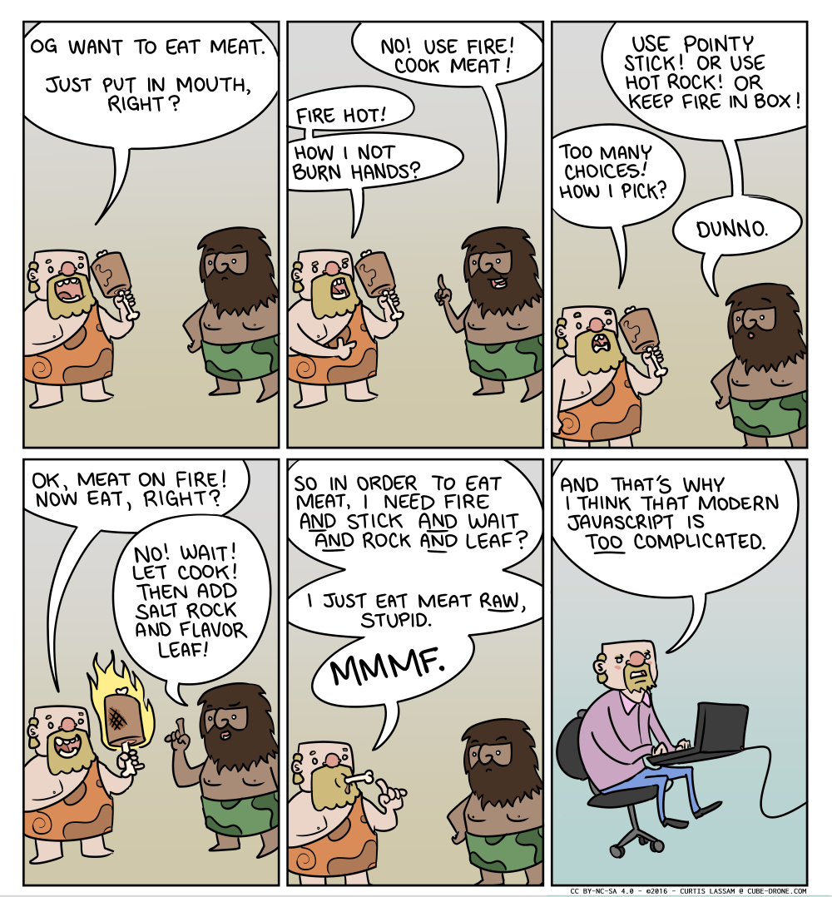
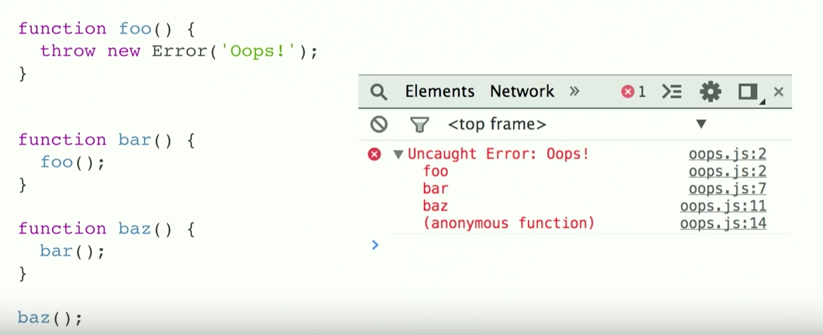
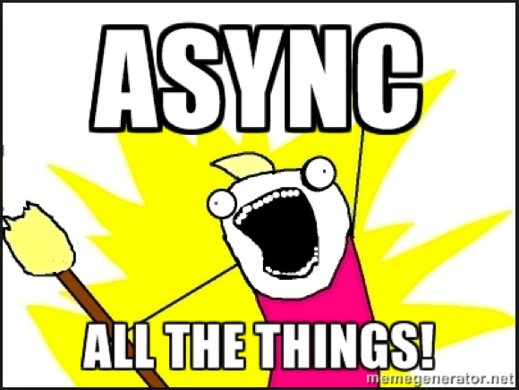
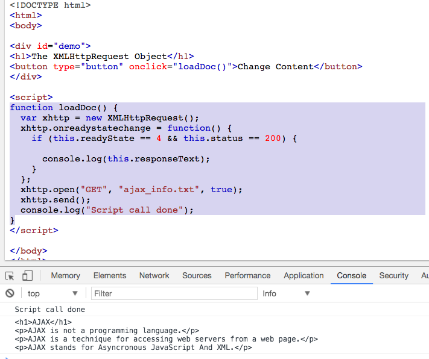

> [原文地址](https://medium.com/@gaurav.pandvia/understanding-javascript-function-executions-tasks-event-loop-call-stack-more-part-1-5683dea1f5ec)

web开发者或者前端工程师，那些我们喜爱的称呼，如今我们在浏览器里几乎可以做任何事情，制作电脑游戏，桌面插件，跨平台手机APP，或者是服务端连接数据库(最受欢迎的是node.js)，我们用脚本语言来做各种各样的事情。因此，我们很有必要了解JavaScript的内部运行机制来更好更高效的使用它，这就是写这篇文章的目的。

如今的JavaScript生态系统比以往的任何时候都复杂并且将继续增加复杂度。构建一个现代的web app需要Webpack，Babel，ESLint，Mocha，Karma，Grunt等等，我们应该使用哪些工具呢？为什么呢？下面这幅漫画完美的演示了如今web开发者的问题。（当你想做一件事时，你发现你需要做的准备工作太多太复杂了，需要学习的内容太多了，需要作出的选择也太多了，这导致你可能不想去做你本来想做的事了。）



在一个JavaScript开发者开始深入使用各种框架和库之前，很有必要了解底层的内部运行机制这些基础知识。大部分JS开发者可能都听说过V8引擎，谷歌浏览器的运行环境，但是很多人可能不知道它是什么意思，用来干什么的。我职业生涯的第一年对这些高级术语以及它们是如何运行代码了解的也很少，好奇心使我想继续深入的了解它到底都干了什么。我决定继续深入，查阅谷歌并且浏览一些优秀的博客，比如( [great talk at JSConf on the event loop](https://www.youtube.com/watch?v=8aGhZQkoFbQ))。因此，我想总结我的学习过程并与大家分享。由于有大量的知识需要了解，我把它分为了两部分。这一部分主要介绍经常使用的术语，第二部分介绍它们之间的关系。

JavaScript是单线程语言，意味着在同一时刻它只能处理一个任务或一个代码片段，它有一个**调用栈**(Call Stack)，与堆(heap)，队列(queue)共同构成了JavaScript并发(Concurrency)模型(由V8引擎实现)。我们首先来了解这些专业术语：


**1.调用栈(Call Stack):**一个记录了函数调用以及当前执行位置的数据结构。当调用函数执行，把它压入栈顶，并且当函数返回时，把它从栈顶弹出。


正确结果是100，图里标错了。

当我们运行这段代码的时候，我们首先会查找mian函数，这是执行的入口。上面图中，是从**console.log(bar(6))**开始执行的，它被压入栈中，接下来调用**bar**函数，然后执行 **foo**，它们依次被压入栈中，当函数返回的时候，它们依次被弹出栈，最后是**console**，所有这些过程都是在一瞬间(ms)完成的。

在浏览器的控制台里，你一定看到过非常长的红字错误栈，它主要指出了当前调用栈的状态以及哪一个函数执行失败，自顶向下的方式显示方式就像栈结构一样(如下图)。



当我们递归地调用一个函数多次时，我们可能会进入死循环，对于Chrome浏览器来说，栈的大小是有限制的，最大限制是16,000，超过限制将会杀死程序并抛出一个错误：**Max Stack Error Reached**(如下图)。


**2.堆：** 堆是非结构化的内存区域，对象是在这里分配的。所有变量和对象的内存分配都是在堆中。

**3.队列：**一个JavaScript运行时，它包括消息队列——一个包含即将被执行的消息和相关的将要被执行的回调函数的列表。当栈中有了足够的空间，一条包含着一系列调用函数的消息从消息队列中取出并放入栈中执行(因此创建了栈帧(stack frame))。当栈中执行函数为空时，一条消息处理完成。这些消息在队列中对外部异步事件作出响应(例如鼠标点击事件以及HTTP请求的响应等)并提供了回调函数。例如如果一个用户点击了一个按钮，但是没有提供任何回调函数，就不会有消息进入消息队列。

### 事件循环(Event Loop)

当我们评估我们JS代码的性能的时候，是指一个函数在栈中执行速度的快慢。`console.log()`将会执行的很快，但是`for `或者`while`执行几百万次循环时就会非常的慢，并且会占据或阻塞调用栈。我们称之为**阻塞脚本(blocking script)**，你可能在Webpage Speed Insights中听说过它。

网络请求可能很慢，图像请求可能很慢，幸好有AJAX这个异步函数来解决这些问题。如果可以，这些请求都通过同步请求来执行，会发生什么呢？网络请求发送到某个服务器，现在这个服务器可能响应的很慢，同时，如果你点击了某个CTA按钮，或者将要执行一些其他的**渲染**(**rendering**)，因为调用栈被阻塞了所以此时什么都不会发生。像Ruby这种多线程语言，可以很好地处理这种情况，但是在JavaScript这种单线程语言中，只有等栈中的函数执行返回。被阻塞的浏览器此时什么都做不了，显然这不是我们想要的结果，那么我们该如何处理呢？

> "JS中的并发——同一时间只做一件事，返回时间不确定，异步调用"



最简单的解决方案是异步回调，意思是我们执行一部分代码并给它一个回调函数，回调函数将在之后某个时刻执行。我们都曾经使用过异步回调，比如AJAX请求：`$.get(),setTimeout(),setInterval(), Promises, etc.`Node全都是异步函数的执行。所有这些异步回调函数不会立即执行，而是在未来的某个时间执行，所以它们不能像`console.log()`这种同步函数被立即压入调用栈，那么问题来了，这些异步回调去哪里了呢，怎么在之后被执行的呢？



我们来看上面的网络请求代码：

1. 请求函数执行，给`onreadystatechange`事件传递了一个匿名函数作为回调，当未来某个时刻收到响应执行这个回调函数。
2. “Script call done!”被立即输出到控制台
3. 在后来的某个时刻，响应结果返回，回调函数执行，输出了响应的body到控制台

对响应调用的解耦使得JavaScript运行时(runtime)在等待异步操作完成的时候可以做其他事情，`2`这里浏览器的APIs开始生效并且调用它的APIs，这些API的线程是由浏览器使用C++实现的，用来处理异步事件，例如DOM事件，http请求，setTimeout等。

现在这些WebAPIs不能不能把它自己的执行代码放入调用栈中，如果它可以，那么这些代码可能会随机出现在你的代码中。我们之前讨论的回调函数消息队列解决了这个问题。`3`任何WebAPI把可以被执行的回调函数放入自己的队列中。**事件循环(Event Loop)**来负责这些队列中回调函数的执行并在调用栈为空时把它们放入调用栈中`4`。事件循环的主要任务是查看调用栈和任务队列，当调用栈为空时把队列中的第一个任务压入栈中。每一个消息或者回调函数执行完毕才会执行新的消息。

```js
while (queue.waitForMessage()) {
  queue.processNextMessage();
}
```


在Web浏览器中，当一个事件发生，注册在事件上的监听器消息可以在任何时候被添加。如果没有注册监听，那么这个事件将不会被处理。所以点击一个元素会添加一条消息，适用于任何其他事件。回调函数的调用作为调用栈中最开始的那一帧，并且由于JavaScript是单线程的，其他的消息将会被挂起，等待调用栈中函数执行完毕并返回。随后的同步函数被调用并在栈中添加新的帧。

地址：[medium原文](https://medium.com/@gaurav.pandvia/understanding-javascript-function-executions-tasks-event-loop-call-stack-more-part-1-5683dea1f5ec) 
